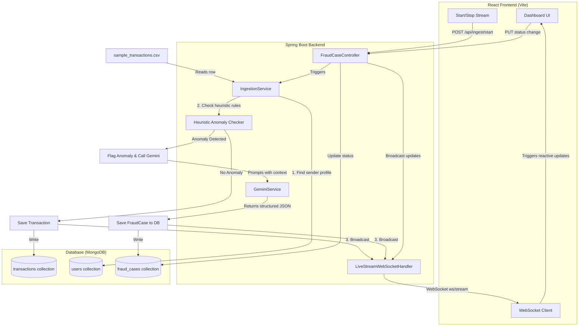

# FraudShield Project Context

This file maintains the active development context, current state, completed work, and next steps for the FraudShield project. It is designed to be easily read by developers and AI agents alike to keep the project synchronized and sustainable.

---

## 📌 Current State
* **Active Git Branch**: `feature/agentic-fraud-shield`
* **Backend Status**: Running locally on Port `8080` (Tomcat)
* **Frontend Status**: Running locally on Port `5173` (Vite)
* **Database Status**: MongoDB running via Docker container `fraudshield-mongodb` (Port `27017`)

---

## 🛠️ Completed Implementations

### 1. Codebase & Agentic Skills
* **[skills/README.md](file:///Users/hemanthbalakrishnanuthalapati/Code%20/google%20hackaton/Google-Hackathon/skills/README.md)**: Main skills index.
* **[skills/development_rules.md](file:///Users/hemanthbalakrishnanuthalapati/Code%20/google%20hackaton/Google-Hackathon/skills/development_rules.md)**: Standardizes Java Spring Boot structure, React patterns, and strict typing.
* **[skills/agentic_architecture.md](file:///Users/hemanthbalakrishnanuthalapati/Code%20/google%20hackaton/Google-Hackathon/skills/agentic_architecture.md)**: Outlines rules for self-documenting APIs, MCP server tool specifications, structured Gemini prompt schemas, and decision auditing records.

### 2. Backend Infrastructure & Logic (Spring Boot)
* **Pre-Seeded Data**:
  * Created [sample_transactions.csv](file:///Users/hemanthbalakrishnanuthalapati/Code%20/google%20hackaton/Google-Hackathon/backend/src/main/resources/sample_transactions.csv) containing test transactions.
  * Implemented [DatabaseSeeder.java](file:///Users/hemanthbalakrishnanuthalapati/Code%20/google%20hackaton/Google-Hackathon/backend/src/main/java/com/fraudshield/backend/config/DatabaseSeeder.java) which auto-seeds Alice's, Bob's, and Charlie's baseline behavior profiles into MongoDB on startup.
* **Real-time Live Stream WebSockets**:
  * Registered `/ws/stream` in [WebSocketConfig.java](file:///Users/hemanthbalakrishnanuthalapati/Code%20/google%20hackaton/Google-Hackathon/backend/src/main/java/com/fraudshield/backend/config/WebSocketConfig.java).
  * Built [LiveStreamWebSocketHandler.java](file:///Users/hemanthbalakrishnanuthalapati/Code%20/google%20hackaton/Google-Hackathon/backend/src/main/java/com/fraudshield/backend/config/LiveStreamWebSocketHandler.java) to manage sessions and broadcast transaction events.
* **AI & Detection Engine**:
  * Built [GeminiService.java](file:///Users/hemanthbalakrishnanuthalapati/Code%20/google%20hackaton/Google-Hackathon/backend/src/main/java/com/fraudshield/backend/service/GeminiService.java) to request structured AI analysis from Gemini 2.5 Flash, with a local rules-based fallback simulator if no `GEMINI_API_KEY` is set.
  * Modified [IngestionService.java](file:///Users/hemanthbalakrishnanuthalapati/Code%20/google%20hackaton/Google-Hackathon/backend/src/main/java/com/fraudshield/backend/service/IngestionService.java) to check baselines (location mismatch, device mismatch, amount anomaly), query Gemini on flags, save cases, and broadcast real-time transaction/alert socket events.
  * Implemented REST APIs in [FraudCaseController.java](file:///Users/hemanthbalakrishnanuthalapati/Code%20/google%20hackaton/Google-Hackathon/backend/src/main/java/com/fraudshield/backend/controller/FraudCaseController.java) to retrieve cases, get user baselines, list transactions, and update case status (e.g. freeze account).

### 3. Frontend Interactive Dashboard (React)
* **Visual Interface**:
  * Rewrote [App.tsx](file:///Users/hemanthbalakrishnanuthalapati/Code%20/google%20hackaton/Google-Hackathon/frontend/src/App.tsx) to establish a live feed of streaming transactions, active alerts list, and an investigation drawer panel displaying transaction attributes vs cardholder baseline profile.
  * Designed dark-theme styling inside [index.css](file:///Users/hemanthbalakrishnanuthalapati/Code%20/google%20hackaton/Google-Hackathon/frontend/src/index.css) utilizing glassmorphism overlays and red/orange glowing badges for high-risk alerts.

---

## 📊 System Architecture & Data Flow

---

## 🚀 Next Steps / Future Enhancements
- [ ] **OpenAPI Integration**: Set up Swagger/OpenAPI documentation in Spring Boot to automatically expose the REST API endpoints to developer portals or external AI agents.
- [ ] **MCP Server Wrapper**: Build a Model Context Protocol (MCP) server (e.g., in Node.js or Python) that interfaces with the Spring Boot REST APIs, allowing external LLM agents to act directly on the FraudShield system.
- [ ] **Advanced Prompting**: Extend `GeminiService.java` to support historic context (e.g., passing the last 5 transactions in the prompt to analyze temporal transaction patterns, such as velocity limits).
