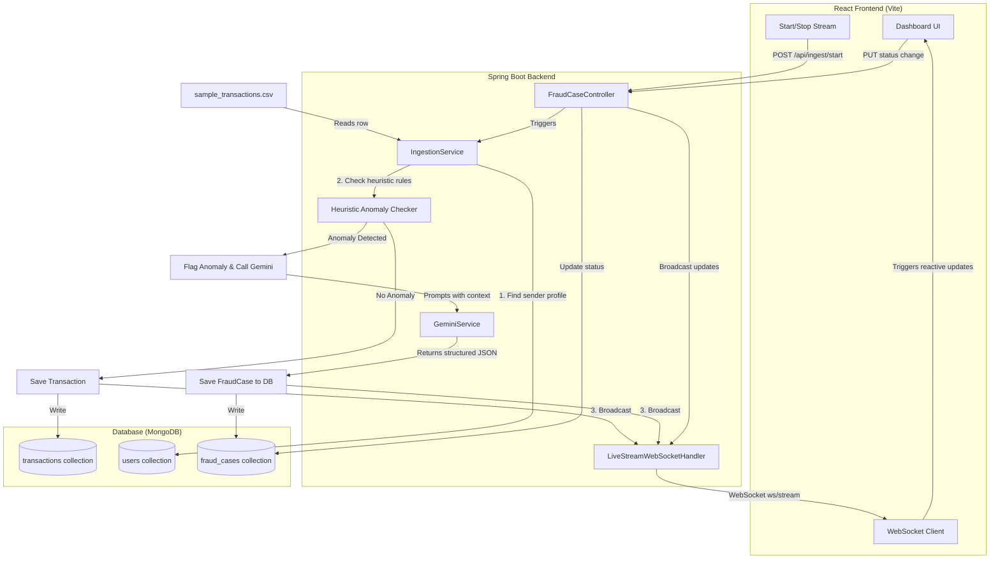

# FraudShield Project Context

This file maintains the active development context, current state, completed work, and next steps for the FraudShield project. It is designed to be easily read by developers and AI agents alike to keep the project synchronized and sustainable.

---

## 📌 Current State
* **Active Git Branch**: `feature/agentic-fraud-shield`
* **Backend Status**: Running locally on Port `8080` (Tomcat)
* **Frontend Status**: Running locally on Port `5173` (Vite)
* **Database Status**: MongoDB running via Docker container `fraudshield-mongodb` (Port `27017`)

---

## 🛠️ Completed Implementations

### 1. Codebase & Agentic Skills
* **[skills/README.md](file:///Users/hemanthbalakrishnanuthalapati/Code%20/google%20hackaton/Google-Hackathon/skills/README.md)**: Main skills index.
* **[skills/development_rules.md](file:///Users/hemanthbalakrishnanuthalapati/Code%20/google%20hackaton/Google-Hackathon/skills/development_rules.md)**: Standardizes Java Spring Boot structure, React patterns, and strict typing.
* **[skills/agentic_architecture.md](file:///Users/hemanthbalakrishnanuthalapati/Code%20/google%20hackaton/Google-Hackathon/skills/agentic_architecture.md)**: Outlines rules for self-documenting APIs, MCP server tool specifications, structured Gemini prompt schemas, and decision auditing records.

### 2. Backend Infrastructure & Logic (Spring Boot)
* **Pre-Seeded Data**:
  * Created [sample_transactions.csv](file:///Users/hemanthbalakrishnanuthalapati/Code%20/google%20hackaton/Google-Hackathon/backend/src/main/resources/sample_transactions.csv) containing test transactions.
  * Implemented [DatabaseSeeder.java](file:///Users/hemanthbalakrishnanuthalapati/Code%20/google%20hackaton/Google-Hackathon/backend/src/main/java/com/fraudshield/backend/config/DatabaseSeeder.java) which auto-seeds Alice's, Bob's, and Charlie's baseline behavior profiles into MongoDB on startup.
* **Real-time Live Stream WebSockets**:
  * Registered `/ws/stream` in [WebSocketConfig.java](file:///Users/hemanthbalakrishnanuthalapati/Code%20/google%20hackaton/Google-Hackathon/backend/src/main/java/com/fraudshield/backend/config/WebSocketConfig.java).
  * Built [LiveStreamWebSocketHandler.java](file:///Users/hemanthbalakrishnanuthalapati/Code%20/google%20hackaton/Google-Hackathon/backend/src/main/java/com/fraudshield/backend/config/LiveStreamWebSocketHandler.java) to manage sessions and broadcast transaction events.
* **AI & Detection Engine**:
  * Built [GeminiService.java](file:///Users/hemanthbalakrishnanuthalapati/Code%20/google%20hackaton/Google-Hackathon/backend/src/main/java/com/fraudshield/backend/service/GeminiService.java) to request structured AI analysis from Gemini 2.5 Flash, with a local rules-based fallback simulator if no `GEMINI_API_KEY` is set.
  * Modified [IngestionService.java](file:///Users/hemanthbalakrishnanuthalapati/Code%20/google%20hackaton/Google-Hackathon/backend/src/main/java/com/fraudshield/backend/service/IngestionService.java) to check baselines (location mismatch, device mismatch, amount anomaly), query Gemini on flags, save cases, and broadcast real-time transaction/alert socket events.
  * Implemented REST APIs in [FraudCaseController.java](file:///Users/hemanthbalakrishnanuthalapati/Code%20/google%20hackaton/Google-Hackathon/backend/src/main/java/com/fraudshield/backend/controller/FraudCaseController.java) to retrieve cases, get user baselines, list transactions, and update case status (e.g. freeze account).
  * **Advanced Stateful Analysis (Velocity)**: Updated [TransactionRepository.java](file:///Users/hemanthbalakrishnanuthalapati/Code%20/google%20hackaton/Google-Hackathon/backend/src/main/java/com/fraudshield/backend/repository/TransactionRepository.java) and [GeminiService.java](file:///Users/hemanthbalakrishnanuthalapati/Code%20/google%20hackaton/Google-Hackathon/backend/src/main/java/com/fraudshield/backend/service/GeminiService.java) to query the cardholder's top 5 recent transactions and incorporate them in the prompt context. This enables real-time detection of velocity and impossible travel anomalies (e.g., card swiped in Tokyo 10 minutes after New York).

### 3. Frontend Interactive Dashboard (React)
* **Visual Interface**:
  * Rewrote [App.tsx](file:///Users/hemanthbalakrishnanuthalapati/Code%20/google%20hackaton/Google-Hackathon/frontend/src/App.tsx) to establish a comprehensive data table of streaming transactions, active alerts queue, and an investigation board. Evaluates baseline flag audits (Location, Device, Amount mismatches) dynamically on the client-side.
  * Designed clean, corporate blue-and-white styling inside [index.css](file:///Users/hemanthbalakrishnanuthalapati/Code%20/google%20hackaton/Google-Hackathon/frontend/src/index.css) with clear warning/alert pills to track the number of flags per transaction.

### 4. Model Context Protocol (MCP) Server Wrapper
* **Integration Wrapper**:
  * Created [mcp_server.py](file:///Users/hemanthbalakrishnanuthalapati/Code%20/google%20hackaton/Google-Hackathon/mcp_server.py) using `FastMCP` (Python SDK).
  * Exposes tools: `get_open_cases()`, `get_user_baseline(account_id)`, `get_case_transactions(account_id)` (read directly from MongoDB), and `update_case_status(case_id, status)` (triggers REST mutation to sync the dashboard and db).
  * Created [verify_mcp.py](file:///Users/hemanthbalakrishnanuthalapati/Code%20/google%20hackaton/Google-Hackathon/verify_mcp.py) to check tool bindings.

### 5. Swagger / OpenAPI Integration
* **Self-Documenting API**:
  * Added `springdoc-openapi` to the Spring Boot [pom.xml](file:///Users/hemanthbalakrishnanuthalapati/Code%20/google%20hackaton/Google-Hackathon/backend/pom.xml).
  * Implemented [OpenApiConfig.java](file:///Users/hemanthbalakrishnanuthalapati/Code%20/google%20hackaton/Google-Hackathon/backend/src/main/java/com/fraudshield/backend/config/OpenApiConfig.java) to set API metadata.
  * Automatically publishes OpenAPI JSON schemas at `/v3/api-docs` and hosts the interactive Swagger UI at `/swagger-ui/index.html` to allow developers and external LLM agents to auto-discover all endpoints.

---

## 📊 System Architecture & Data Flow



---

## 🚀 Completed Enhancements
- [x] **OpenAPI Integration**: Set up Swagger/OpenAPI documentation in Spring Boot to automatically expose the REST API endpoints to developer portals or external AI agents.
- [x] **Advanced Prompting**: Extend `GeminiService.java` to support historic context (e.g., passing the last 5 transactions in the prompt to analyze temporal transaction patterns, such as velocity limits).

---

## 🏦 Enterprise Differentiator Roadmap

> These features are ordered by priority. Work through them one at a time.
> Each item has a clear problem statement, what to build, and which files to touch.
> Mark `[ ]` → `[x]` as each feature is completed.

---

### Feature 1 — Living Behavioral Profile (Auto-Updating Baselines)
**Status**: `[x] Completed`

**The Problem**: User baselines are seeded once at startup and never change. A user who moves to a new city, gets a new phone, or changes their spending habits will keep getting false-positive fraud alerts forever. Banks lose customer trust over this.

**What to Build**:
- After every transaction that passes without fraud flags, call a new Gemini prompt to evaluate if the user's profile should evolve.
- If a new location appears 3+ times in recent history → add it to `frequentLocations`.
- Recalculate `averageTransactionValue` on a rolling 90-day window.
- Remove devices from `frequentDevices` if unused for 60+ days.

**Gemini Output Schema**:
```json
{
  "shouldUpdate": true,
  "addLocations": ["Paris"],
  "removeLocations": [],
  "updatedAverageValue": 245.50,
  "removeDevices": ["BlackBerry"]
}
```

**Files to Touch**:
- `IngestionService.java` — call profile update after saving a clean transaction
- `GeminiService.java` — add `updateUserProfile(User user, List<Transaction> recent)` method
- `UserRepository.java` — add `save()` call to persist updates
- `FraudCaseController.java` — expose `GET /api/users` endpoint if not already present

**Why It Stands Out**: Kills false positives over time. System gets smarter the longer a customer uses it.

---

### Feature 2 — Receiver Network Analysis (Money Mule Detection)
**Status**: `[x] Incorporated into Feature 3`

**The Problem**: Current system only profiles the **sender**. Sophisticated fraud uses money mule chains — victim sends to mule 1, mule 1 to mule 2, mule 2 offshore. Each individual hop looks normal. Only the receiver's network pattern reveals the crime.

**What to Build**:
- When a transaction is flagged, also pull the **receiver account's** last 20 incoming transactions from MongoDB.
- Check: how many unique senders sent to this receiver in the last 24 hours?
- Check: did this receiver immediately forward money after receiving?
- Pass this receiver context to Gemini alongside the existing sender context.

**Gemini Output Schema** (extend existing `GeminiAnalysisResult`):
```json
{
  "networkRisk": 0.9,
  "networkPattern": "Receiver ACC-789 received from 23 unique senders in 6h and forwarded 94% of funds within minutes. Classic money mule behavior.",
  "isMuleAccount": true
}
```

**Files to Touch**:
- `TransactionRepository.java` — add `findByReceiverAccountOrderByTimestampDesc(String receiverAccount, Pageable pageable)`
- `GeminiService.java` — extend `analyzeTransaction()` to accept receiver history
- `IngestionService.java` — fetch receiver transactions before calling Gemini
- `GeminiAnalysisResult.java` (inner class) — add `networkRisk`, `networkPattern`, `isMuleAccount` fields
- `App.tsx` — display network risk in the Investigation Board panel

**Why It Stands Out**: Turns FraudShield from single-transaction analysis into a network intelligence platform. No rule engine can do this — only LLM contextual reasoning can.

---

### Feature 3 — Autonomous Investigation Agent (Agentic Case Handler)
**Status**: `[x] Completed`

**The Problem**: Human analysts currently spend 20–45 minutes per case manually pulling history, checking related accounts, writing up reports, and drafting customer communication. Banks employ thousands of analysts just for this. It is the single biggest cost in fraud operations.

**What to Build**:
- When a `FraudCase` is created with `riskScore > 0.7`, automatically trigger a multi-step agentic investigation loop.
- The agent uses the existing MCP tools + 2 new tools to autonomously gather evidence, then calls Gemini to synthesize a full investigation report.
- The human analyst only sees the finished report and clicks Approve or Override.

**New MCP Tools to Add** (in `mcp_server.py`):
- `get_receiver_profile(receiver_account_id)` — fetch receiver's transaction history
- `submit_investigation_report(case_id, report_json)` — attach the agent's findings to the case

**Agent Investigation Steps**:
```
Step 1: get_case_transactions(accountId)         → sender full history
Step 2: get_user_baseline(accountId)             → sender profile
Step 3: get_receiver_profile(receiverAccount)    → mule check
Step 4: Gemini synthesizes all → produces:
        { investigationSummary, evidenceStrength,
          recommendedAction, customerMessage, auditTrail }
Step 5: submit_investigation_report(caseId, report)
Step 6: update_case_status(caseId, recommendedAction)
```

**Files to Touch**:
- `mcp_server.py` — add 2 new tool functions
- `FraudCase.java` — add `investigationReport` String field
- `FraudCaseController.java` — add `PUT /api/cases/{id}/report` endpoint
- `GeminiService.java` — add `runAgentInvestigation()` method
- `IngestionService.java` — trigger agent investigation async after high-risk case is saved
- `App.tsx` — show investigation report in Investigation Board

**Why It Stands Out**: Removes the human bottleneck entirely for high-confidence cases. Investigation time: 45 minutes → 30 seconds.

---

### Feature 4 — Regulatory Explanation Engine (Compliance-Ready Audit Trail)
**Status**: `[x] Completed`

**The Problem**: GDPR Article 22, RBI guidelines, and US FFIEC regulations require banks to provide a **human-readable explanation** to any customer whose transaction was automatically declined or account frozen. Banks are being fined billions for "the algorithm said so." Their black-box ML models cannot explain themselves.

**What to Build**:
- Extend `GeminiAnalysisResult` with two new fields: `customerExplanation` and `regulatoryAuditRecord`.
- `customerExplanation` — plain English, non-technical, suitable to send directly to the customer via SMS/email.
- `regulatoryAuditRecord` — structured JSON with timestamp, all signals, reasoning chain, and recommended action — suitable for a regulator audit request.
- Store both fields permanently on every `FraudCase`.

**Gemini Prompt Extension** (add to existing prompt in `GeminiService.java`):
```
Also generate:
- customerExplanation: a polite, plain-English message (max 3 sentences) 
  explaining why this transaction was flagged, suitable to send to the customer.
- regulatoryAuditRecord: a JSON-structured audit entry with all signals, 
  reasoning steps, timestamps, and decision rationale for regulatory review.
```

**Files to Touch**:
- `GeminiService.java` — extend prompt and `GeminiAnalysisResult` inner class
- `FraudCase.java` — add `customerExplanation` and `regulatoryAuditRecord` fields
- `FraudCaseController.java` — expose `GET /api/cases/{id}/audit` endpoint
- `App.tsx` — add "Customer Message" and "Audit Record" tabs in Investigation Board

**Why It Stands Out**: This reframes FraudShield as a **compliance product**, not just a fraud tool. Banks pay 10x more for compliance tooling than fraud detection.

---

### Feature 5 — Pre-Transaction Behavioral Drift Detector (Account Takeover Prevention)
**Status**: `[ ] Not started`

**The Problem**: When a fraudster takes over an account via phishing or SIM swap, they have a 30-second window before the victim notices. Rule engines only react after a fraudulent transaction is made. By then the money is gone.

**What to Build**:
- Track **pre-transaction signals** on the user object: last login device, last login location, recent password reset, recent failed login count.
- Before processing any transaction, check if the account is in "elevated suspicion" state based on these session signals.
- If elevated → hold the transaction and force a 30-second customer confirmation challenge (WebSocket ping to the dashboard).

**New Fields on `User.java`**:
```java
private String lastLoginDevice;
private String lastLoginLocation;
private LocalDateTime lastPasswordReset;
private int recentFailedLoginCount;
private boolean elevatedSuspicion;
```

**New REST Endpoint**:
- `POST /api/users/{accountId}/session` — call this when a login event occurs to update session metadata

**Logic in `IngestionService.java`**:
```java
if (user.isElevatedSuspicion()) {
    // Hold transaction — broadcast CHALLENGE event via WebSocket
    // Do not process until confirmed or timeout
}
```

**Files to Touch**:
- `User.java` — add session signal fields
- `UserRepository.java` — no changes needed
- `IngestionService.java` — add pre-check before `processTransaction()`
- `FraudCaseController.java` — add `POST /api/users/{id}/session` endpoint
- `LiveStreamWebSocketHandler.java` — add `CHALLENGE` event type
- `App.tsx` — show challenge banner when `CHALLENGE` event arrives

**Why It Stands Out**: Stops fraud before it happens. Every other system reacts. This one predicts and intercepts.

---

## 📋 Feature Progress Summary

| # | Feature | Status | Impact |
|---|---------|--------|--------|
| 1 | Living Behavioral Profile | `[x] Completed` | Kills false positives |
| 2 | Receiver Network / Money Mule Detection | `[x] Incorporated into Feature 3` | Catches organized fraud rings |
| 3 | Autonomous Investigation Agent | `[x] Completed` | Removes analyst bottleneck |
| 4 | Regulatory Explanation Engine | `[x] Completed` | Compliance product value |
| 5 | Pre-Transaction Drift Detector | `[ ] Not started` | Stops account takeover |
